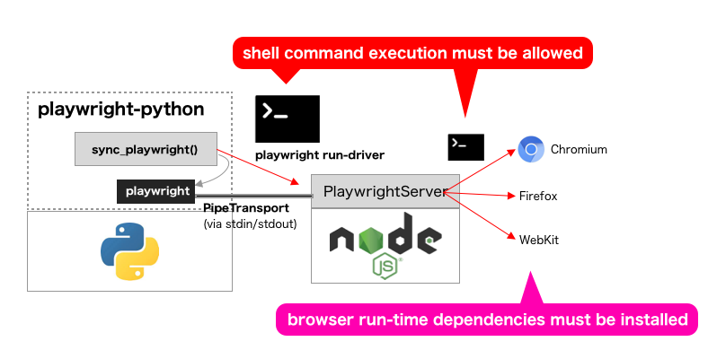
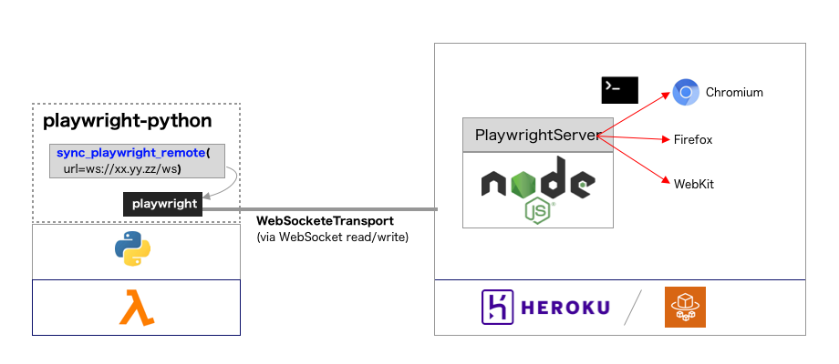

# Example of "Playwright server"

playwright-python requires shell execution and browser run-time dependencies.



* By replacing PipeTransport with WebSocketTransport, we can use automation script on AWS Lambda or other serverless inflastructures.
* Browser executor is separated. It just use official Playwright docker image (mcr.microsoft.com/playwright).



## Prepare Playwright server

```
heroku create
heroku stack:set container
heroku git:remote
git push heroku main
```

After deploying, we can see the log (`heroku logs -t`):

```
2021-07-07T13:00:33.691353+00:00 heroku[web.1]: State changed from down to starting
2021-07-07T13:01:12.651064+00:00 heroku[web.1]: Starting process with command `/bin/sh -c ./node_modules/.bin/playwright\ run-server\ \13011`
2021-07-07T13:01:17.061869+00:00 app[web.1]: Listening on ws://127.0.0.1:13011/ws
2021-07-07T13:01:17.145695+00:00 heroku[web.1]: State changed from starting to up
```

## Execute script on Pure-Python environment

Connecting to the Playwright server on Heroku, via WebSocket.

```
PLAYWRIGHT_WS_URL=wss://myapp-playground1.herokuapp.com/ws python3 ex.py
```

## Execute script locally via WebSocket

```
npx playwright run-server 8080 &
python3 ex.py
```
